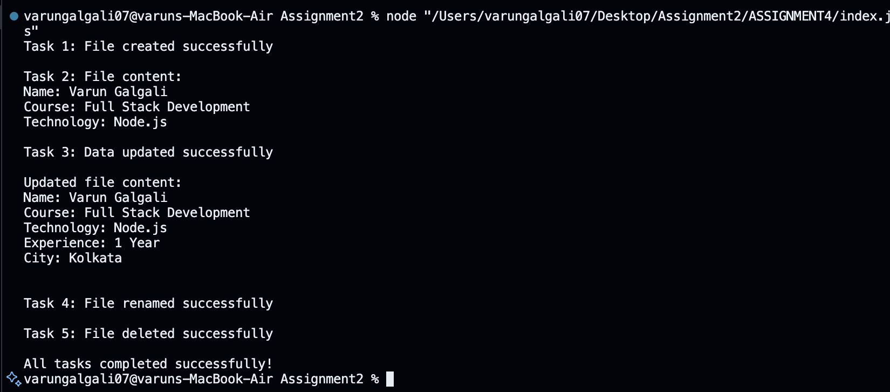

# Student File Handling Assignment

## Assignment Explanation

This project uses the Node.js `fs` module to work with files.

The program completes the following tasks:

1. Creates a file named `student.txt` using `fs.writeFile()`.
2. Reads and displays the file using `fs.readFile()`.
3. Adds experience and city using `fs.appendFile()`.
4. Renames `student.txt` to `studentDetails.txt` using `fs.rename()`.
5. Deletes `studentDetails.txt` using `fs.unlink()`.

Each task starts after the previous task is completed.

## Student Information

The file contains:

```text
Name: Varun Galgali
Course: Full Stack Development
Technology: Node.js
Experience: 1 Year
City: Kolkata
```

## Project Structure

```text
ASSIGNMENT4
├── screenshots
│   └── output.png
├── index.js
├── student.txt
├── package.json
└── README.md
```

## How to Run the Program

1. Open the `ASSIGNMENT4` folder in VS Code.
2. Open the terminal.
3. Run:

```bash
node index.js
```

You can also run:

```bash
npm start
```

## Output Screenshot

The following screenshot shows the output of all five tasks:



## Error Handling

Every file operation checks for an error.

If an error occurs, the program displays an error message and stops that operation.

## Note

The program renames `student.txt` to `studentDetails.txt` and then deletes it during Task 5.

A copy of `student.txt` is included in the submitted project folder because it is listed in the assignment submission requirements.